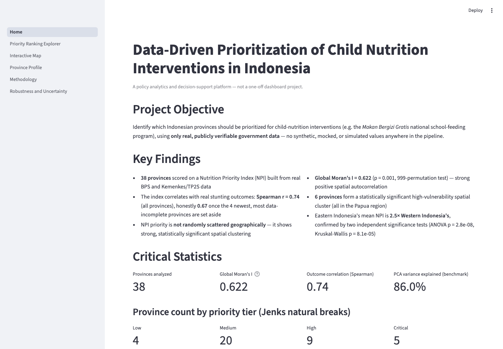
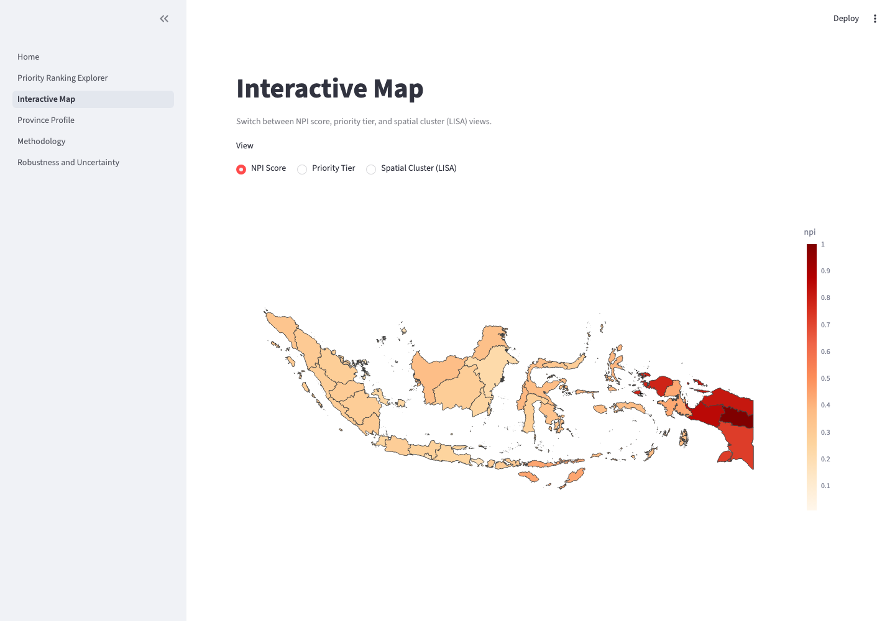
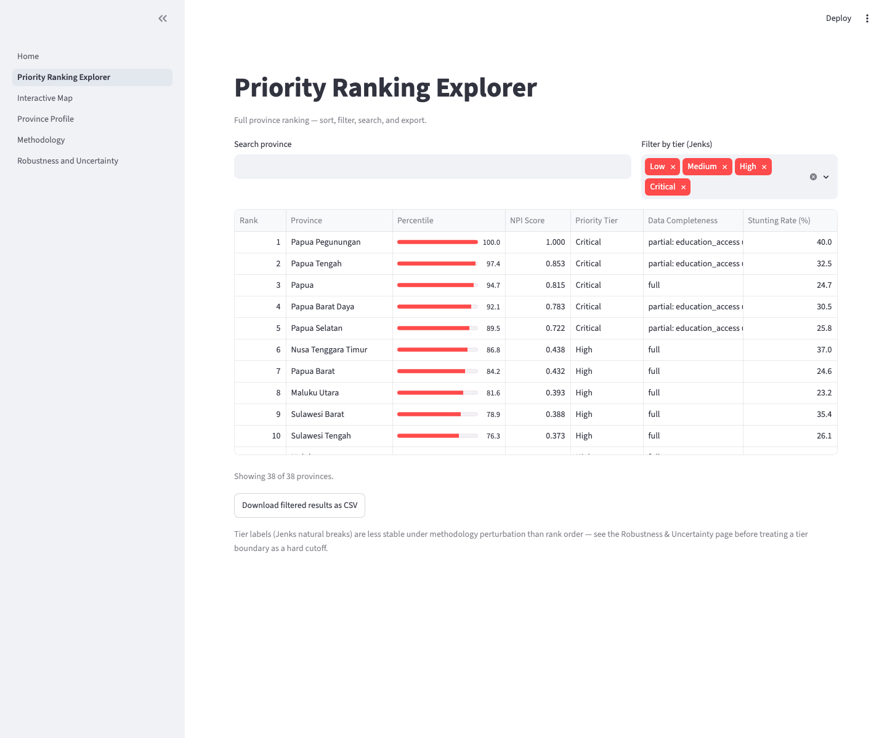
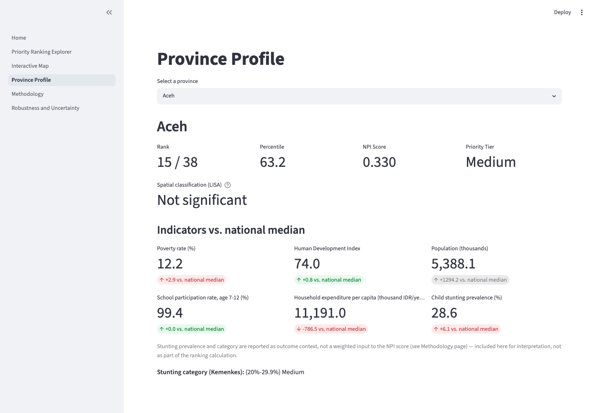
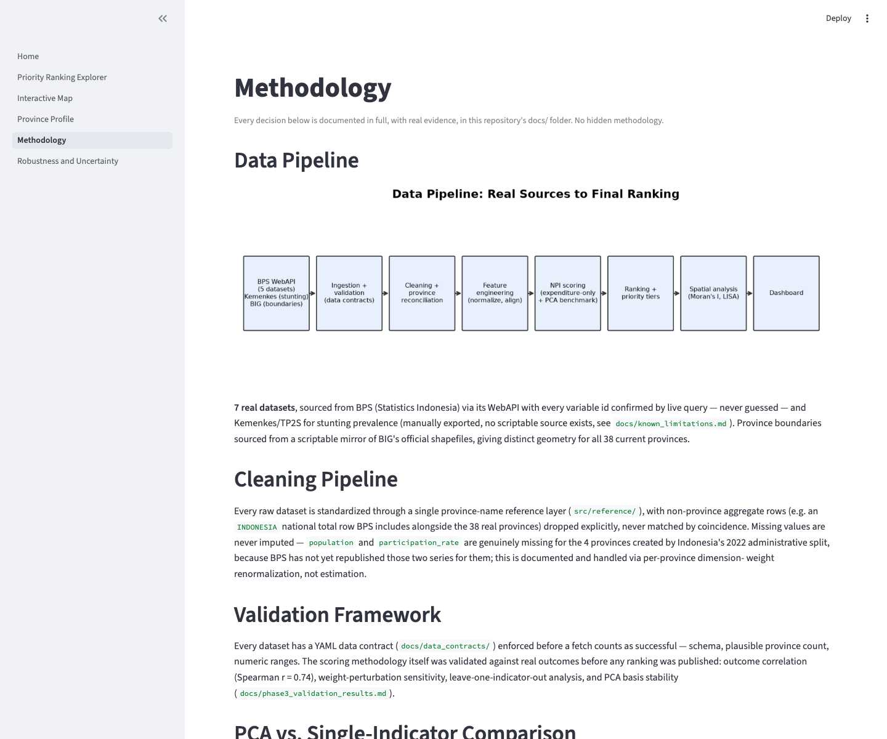
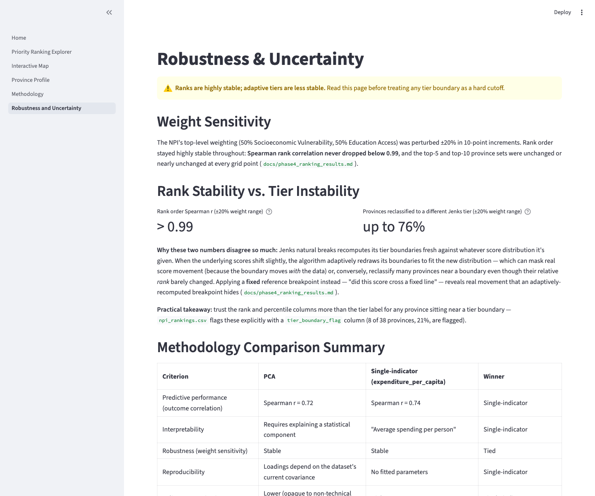

# Data-Driven Prioritization of Child Nutrition Interventions in Indonesia

**A policy analytics and decision-support platform, not a one-off dashboard
project.** Real government data only — zero synthetic, mocked, or simulated
values anywhere in the pipeline. Every methodological decision is validated
against evidence and documented before being published.

[]() []() []()

📊 **Dashboard:** not yet deployed to a public URL — run it locally in under a minute (`pip install -r requirements.txt && streamlit run dashboard/Home.py`, no API keys needed) or deploy it via [DEPLOYMENT.md](DEPLOYMENT.md) · 📄 [Executive Summary](docs/executive_summary.md) · 🎯 [Recruiter Guide](docs/recruiter_guide.md) · 🗺️ [Full Roadmap](PROJECT_ROADMAP.md)

---

## 1. Problem Statement

Indonesia has limited resources for child-nutrition interventions (e.g. the
*Makan Bergizi Gratis* national school-feeding program) and 38 provinces with
very different needs. **Which provinces should be prioritized, and on what
basis?** This project builds a transparent, evidence-based Nutrition Priority
Index (NPI) to answer that question — and validates every step against real
data rather than asserting a result.

## 2. Why It Matters

A prioritization tool that can't show its work isn't useful to a policymaker
who has to defend a resource-allocation decision. This project treats that as
the actual design constraint: every dataset is traceable to a real government
source, every methodological choice is tested against an alternative before
being adopted, and every known limitation is documented in plain language
rather than buried. The goal is a tool a skeptical analyst — or a skeptical
recruiter — can audit end to end.

## 3. Data Sources

| Dataset | Source | Access method | Provinces covered |
|---|---|---|---|
| Poverty rate | BPS (Statistics Indonesia) | WebAPI | 38/38 |
| Human Development Index | BPS | WebAPI | 38/38 |
| Population | BPS | WebAPI | 34/38 *(real publication gap — BPS hasn't republished this series since the 2022 province split)* |
| School participation rate | BPS | WebAPI | 34/38 *(same gap)* |
| Household expenditure per capita | BPS | WebAPI | 38/38 |
| Child stunting prevalence | Kemenkes / TP2S | Manual Tableau export *(no scriptable source exists — 6 alternatives investigated, see `docs/known_limitations.md`)* | 38/38 |
| Province boundaries | BIG (via a scriptable GitHub mirror) | Direct download | 38/38 |

Full provenance — source URLs, publication dates, checksums — is generated
from real ingestion runs, never hand-written: [docs/data_inventory.md](docs/data_inventory.md).

## 4. Methodology

A Nutrition Priority Index combining two dimensions: **Socioeconomic
Vulnerability** and **Education Access**. The Socioeconomic Vulnerability
input was decided empirically, not assumed:

| | PCA composite (3 indicators) | `expenditure_per_capita` alone |
|---|---|---|
| Predictive performance | Spearman r = 0.72 | **Spearman r = 0.74** |
| Interpretability | Requires explaining a statistical component | **"Average spending per person"** |
| Reproducibility | Loadings depend on the dataset's current covariance | **No fitted parameters** |
| Decision matrix score | 13/25 | **23/25 → promoted to primary** |

PCA's textbook rationale (avoid double-counting 3 collinear indicators,
r up to 0.88) was correct — it just didn't translate into a measurably better
index on this data. PCA is **retained as a documented sensitivity benchmark**,
not deleted. Full derivation: [docs/phase3_methodology_comparison.md](docs/phase3_methodology_comparison.md), [docs/phase3_final_methodology_decision.md](docs/phase3_final_methodology_decision.md).

Child stunting prevalence is reported as **outcome context, never a weighted
input** — avoiding the circular logic of validating an index against the
thing it was built from. See [docs/phase2_framework_design.md](docs/phase2_framework_design.md).

## 5. Validation

Before any ranking was published:

- **Outcome correlation**: Spearman r = 0.74 (all 38 provinces), honestly
  **0.67** once the 4 partial-coverage provinces are excluded — both reported,
  not just the more flattering one.
- **Weight sensitivity**: rank order stable at Spearman r > 0.99 across a ±20%
  weighting perturbation.
- **Leave-one-indicator-out**: identified `poverty_rate` as the most
  influential indicator by two independent methods.
- **PCA basis stability**: confirmed stable across 38 leave-one-province-out
  refits (max loading shift 0.077).

Full results: [docs/phase3_validation_results.md](docs/phase3_validation_results.md).

## 6. Spatial Analysis

| Statistic | Value |
|---|---|
| Global Moran's I | **0.622** (p = 0.001, 999-permutation test) |
| Significant local clusters (LISA) | 6 provinces, one contiguous High-High cluster (all Papua region) |
| Regional disparity (Eastern vs. Western mean NPI) | **2.5×**, ANOVA p = 2.8×10⁻⁸, Kruskal-Wallis p = 8.1×10⁻⁵ |

Resolved a real geometry problem along the way: the obvious boundary source
(GADM) is missing 4 current provinces, and the documented workaround
(duplicate parent polygons) was rejected after testing showed it would distort
the spatial statistics specifically — a better, scriptable, distinct-geometry
source was found and substituted instead. Full results: [docs/phase5_spatial_results.md](docs/phase5_spatial_results.md), methodology: [docs/phase5_geometry_reconciliation.md](docs/phase5_geometry_reconciliation.md).

## 7. Key Findings

1. The priority ranking is **empirically validated, not asserted** — against
   real outcomes, against weighting perturbation, and against an alternative
   methodology.
2. Priority is **geographically clustered, not randomly distributed** — strong
   global autocorrelation, a significant 6-province cluster, and a 2.5×
   regional disparity confirmed by two independent tests.
3. **Rank order is highly stable; adaptive tier labels are not** — up to 76%
   of provinces can be reclassified to a different priority tier under small
   methodology changes, even while their relative rank barely moves. Trust the
   rank/percentile columns over a tier label sitting near a boundary.
4. **Honesty about limitations is part of the deliverable** — every real data
   gap (missing series, no scriptable source, a stale government endpoint) is
   documented with what was tried and why, not hidden.

## 8. Dashboard

Interactive Streamlit dashboard, 6 pages: Executive Overview, Priority Ranking
Explorer (search/filter/sort/CSV export), Interactive Map (NPI / Tier / LISA
cluster views), Province Profile, Methodology, and Robustness & Uncertainty.

| Executive Overview | Interactive Map |
|---|---|
|  |  |

| Priority Ranking Explorer | Province Profile |
|---|---|
|  |  |

| Methodology | Robustness & Uncertainty |
|---|---|
|  |  |

Run it yourself — no API keys needed, ships with a committed data snapshot:

```bash
pip install -r requirements.txt
streamlit run dashboard/Home.py
```

Full deployment instructions (local + Streamlit Community Cloud): [DEPLOYMENT.md](DEPLOYMENT.md).

## 9. Reproducibility

The full analysis pipeline (not required just to view the dashboard — see
above) is reproducible end to end:

```bash
git clone <repo> && cd nutrition-analytics-indonesia
python -m venv .venv && source .venv/bin/activate
make install
cp .env.example .env
# Sign up free at https://webapi.bps.go.id/, paste the App ID into .env as BPS_API_KEY
make fetch                          # 6 of 7 datasets, fully scripted
# Manually export the stunting crosstab (docs/known_limitations.md §3) to
# data/external/stunting_tableau_crosstab_2024.xlsx, then:
python -m src.ingestion.fetch_stunting_ssgi --manual-xlsx data/external/stunting_tableau_crosstab_2024.xlsx
make validate && make clean-data && make rankings
make fetch-boundaries && make spatial   # ~500MB raw download; real distinct 38-province geometry
python -m dashboard.prepare_data        # refresh the dashboard's data snapshot
make test                               # 67 tests, no network required
```

Every dataset has a YAML data contract enforced before a fetch counts as
successful; every ingestion run is checksummed and logged in an append-only
manifest ([docs/data_inventory.md](docs/data_inventory.md), generated, never
hand-written). Structural limitations and the alternatives investigated for
each are in [docs/known_limitations.md](docs/known_limitations.md).

### Repository structure

```
nutrition-analytics-indonesia/
├── config/              dataset configs (datasets.yml, metadata.yml, npi_weights.yml)
├── data/{raw,interim,processed,external}/   gitignored; always re-fetched/recomputed
├── docs/                per-phase methodology + results docs (20+), governance docs, portfolio docs
├── src/
│   ├── ingestion/       fetch scripts + orchestrator
│   ├── reference/       province name standardization (single source of truth)
│   ├── cleaning/        standardization, missing-data profiling, merging
│   ├── features/        normalization, directionality alignment, missing-value policy
│   ├── scoring/         PCA/single-indicator composites, NPI, ranking, validation
│   ├── geospatial/      boundaries, spatial join, Moran's I/LISA, regions, maps
│   ├── validation/      data-contract enforcement
│   └── utils/           HTTP retry, config, provenance/manifest
├── dashboard/            Streamlit app (6 pages) + committed presentation data snapshot
├── tests/                67 unit tests, no real network calls
├── .github/workflows/    CI: tests + contract validation
└── reports/{maps,portfolio_assets}/   generated maps, diagrams, dashboard screenshots
```

## 10. Future Work

- **Phase 7 — Policy Insights**: intervention recommendations grounded in the
  validated priority index, an executive-summary PDF, and a full policy report.
- **Re-running with future-year data**: most of the pipeline is fully
  scripted; the stunting export and the BPS API key are the 2 steps that
  currently require a human action — see `docs/known_limitations.md`.
- **PCA-vs-single-indicator re-comparison**: the methodology decision was made
  on one data snapshot; re-running the comparison when new years' data arrive
  would confirm whether the decision still holds.
- **Replacing GADM's 34-province geometry in `data/processed/merged_*`'s
  boundaries fallback** with the Phase 5 distinct-geometry source project-wide,
  not just for spatial analysis.
